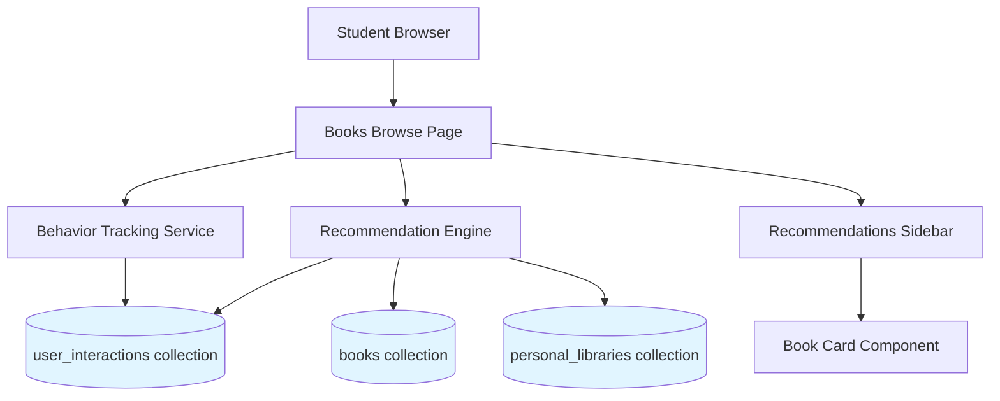

# Design Document: Smart Book Recommendation System

## Overview

The Smart Book Recommendation System enhances the student browsing experience by providing personalized book suggestions based on their interaction history. The system tracks user behavior (book views and searches), analyzes patterns to identify relevant books through category and tag matching, and displays recommendations in a sidebar component that updates dynamically as students browse and search.

### Key Design Principles

1. **Privacy-First**: User behavior data is stored securely and associated only with authenticated users
2. **Performance**: Recommendations are generated efficiently using MongoDB aggregation pipelines
3. **Relevance**: Multi-factor scoring ensures suggestions are genuinely useful
4. **Non-Intrusive**: Sidebar design complements existing UI without disrupting workflow
5. **Progressive Enhancement**: System works with or without historical data

## Architecture

### System Components



### Data Flow

1. **Tracking Phase**: User views book or performs search → Event recorded in `user_interactions` collection
2. **Analysis Phase**: Recommendation Engine queries user history → Identifies patterns (categories, tags, authors)
3. **Generation Phase**: Engine scores candidate books → Filters and ranks by relevance
4. **Display Phase**: Top recommendations sent to sidebar → Rendered as book cards
5. **Update Phase**: User interaction triggers re-calculation → Sidebar refreshes with new suggestions

## Components and Interfaces

### 1. Database Schema

#### user_interactions Collection

```javascript
{
  _id: ObjectId,
  userId: ObjectId,              // Reference to users collection
  userEmail: String,             // Denormalized for quick lookup
  eventType: String,             // "view" | "search"
  timestamp: Date,               // When the interaction occurred
  
  // For view events
  bookId: ObjectId,              // Reference to books collection (optional)
  bookTitle: String,             // Denormalized book data
  bookAuthor: String,
  bookCategories: [String],      // e.g., ["Computer Science", "AI"]
  bookTags: [String],            // e.g., ["machine-learning", "python"]
  
  // For search events
  searchQuery: String,           // The search text (optional)
  searchFilters: {               // Applied filters
    formats: [String],
    yearRange: [Number, Number],
    availability: [String]
  },
  
  // Metadata
  expiresAt: Date                // TTL index for automatic cleanup (90 days)
}
```

**Indexes:**
- `{ userId: 1, timestamp: -1 }` - Fast user history queries
- `{ userEmail: 1, eventType: 1 }` - Quick filtering by event type
- `{ expiresAt: 1 }` - TTL index for automatic data cleanup
- `{ bookId: 1 }` - Fast book-specific lookups

#### books Collection (Existing - Extensions)

```javascript
{
  _id: ObjectId,
  title: String,
  author: String,
  isbn: String,
  year: Number,
  publisher: String,
  format: String,              // "Physical" | "eBook"
  status: String,              // "available" | "checked-out" | "reserved"
  shelf: String,
  loanPolicy: String,
  
  // NEW FIELDS for recommendations
  categories: [String],        // e.g., ["Computer Science", "Programming"]
  tags: [String],              // e.g., ["javascript", "web-development", "beginner"]
  description: String,         // Book description for future semantic matching
  coverImageUrl: String,       // For better visual display
  popularityScore: Number,     // Calculated from borrow/view frequency
  publishedDate: Date,         // More precise than year
  
  // Existing fields...
}
```

### 2. API Endpoints

#### POST /api/student/books/track

Records user interaction events.

**Request Body:**
```javascript
{
  eventType: "view" | "search",
  bookId: String,              // Required for "view" events
  searchQuery: String,         // Required for "search" events
  searchFilters: Object        // Optional for "search" events
}
```

**Response:**
```javascript
{
  ok: true,
  interactionId: String
}
```

**Error Handling:**
- 401: Unauthorized (no session)
- 400: Invalid request (missing required fields)
- 500: Server error

#### GET /api/student/books/recommendations

Generates personalized book recommendations.

**Query Parameters:**
- `limit` (optional, default: 10): Maximum number of recommendations
- `context` (optional): "search" | "browse" - Affects scoring weights
- `currentBookId` (optional): Exclude this book from results

**Response:**
```javascript
{
  ok: true,
  recommendations: [
    {
      _id: String,
      title: String,
      author: String,
      year: Number,
      format: String,
      status: String,
      categories: [String],
      tags: [String],
      coverImageUrl: String,
      relevanceScore: Number,    // 0-100 score
      matchReasons: [String]     // e.g., ["Same category: Computer Science", "Similar tags"]
    }
  ],
  basedOn: {
    viewCount: Number,
    searchCount: Number,
    topCategories: [String],
    topTags: [String]
  }
}
```

**Scoring Algorithm:**
```javascript
relevanceScore = 
  (categoryMatches * 30) +           // 30 points per matching category
  (tagMatches * 20) +                // 20 points per matching tag
  (authorMatch * 15) +               // 15 points if same author
  (recencyBoost * 10) +              // 10 points for recent interactions
  (popularityScore * 0.25)           // Up to 25 points for popular books
```

### 3. React Components

#### RecommendationsSidebar Component

**Location:** `src/components/recommendations-sidebar.jsx`

**Props:**
```javascript
{
  className: String,           // Optional styling
  maxItems: Number,            // Default: 10
  context: "search" | "browse" // Affects which recommendations to show
}
```

**State:**
```javascript
{
  recommendations: Array,
  loading: Boolean,
  error: String | null,
  expanded: Boolean            // For mobile collapse/expand
}
```

**Features:**
- Auto-refresh on search/filter changes (debounced 500ms)
- Loading skeleton states
- Empty state messaging
- Click tracking (records view event when recommendation clicked)
- Responsive design (collapsible on mobile)

#### RecommendationCard Component

**Location:** `src/components/recommendation-card.jsx`

**Props:**
```javascript
{
  book: Object,                // Book data with relevanceScore
  onClick: Function,           // Click handler
  compact: Boolean             // Compact vs. full display mode
}
```

**Display:**
- Book cover image (or placeholder)
- Title (truncated to 2 lines)
- Author name
- Status chip
- Match reason badge (e.g., "Similar to your searches")
- Hover effect with quick actions

### 4. Client-Side Services

#### BehaviorTracker Service

**Location:** `src/lib/behavior-tracker.js`

**Methods:**

```javascript
// Track book view
async trackBookView(bookId, bookData)

// Track search query
async trackSearch(query, filters)

// Batch tracking for performance
async flushQueue()
```

**Features:**
- Debouncing to prevent excessive API calls
- Queue-based batching (flush every 5 seconds or 10 events)
- Automatic retry on failure
- Local storage fallback for offline scenarios

#### RecommendationService

**Location:** `src/lib/recommendation-service.js`

**Methods:**

```javascript
// Fetch recommendations
async getRecommendations(options)

// Refresh recommendations
async refreshRecommendations()

// Get cached recommendations
getCachedRecommendations()
```

**Features:**
- Client-side caching (5-minute TTL)
- Automatic refresh on user actions
- Optimistic updates

## Data Models

### Interaction Event Model

```javascript
class InteractionEvent {
  constructor(userId, eventType, data) {
    this.userId = userId;
    this.userEmail = data.userEmail;
    this.eventType = eventType; // "view" | "search"
    this.timestamp = new Date();
    this.expiresAt = new Date(Date.now() + 90 * 24 * 60 * 60 * 1000); // 90 days
    
    if (eventType === "view") {
      this.bookId = data.bookId;
      this.bookTitle = data.bookTitle;
      this.bookAuthor = data.bookAuthor;
      this.bookCategories = data.bookCategories || [];
      this.bookTags = data.bookTags || [];
    } else if (eventType === "search") {
      this.searchQuery = data.searchQuery;
      this.searchFilters = data.searchFilters || {};
    }
  }
  
  validate() {
    if (!this.userId || !this.eventType) return false;
    if (this.eventType === "view" && !this.bookId) return false;
    if (this.eventType === "search" && !this.searchQuery) return false;
    return true;
  }
}
```

### Recommendation Model

```javascript
class Recommendation {
  constructor(book, userHistory) {
    this.book = book;
    this.relevanceScore = this.calculateScore(book, userHistory);
    this.matchReasons = this.generateMatchReasons(book, userHistory);
  }
  
  calculateScore(book, userHistory) {
    let score = 0;
    
    // Category matching
    const categoryMatches = this.countMatches(
      book.categories,
      userHistory.topCategories
    );
    score += categoryMatches * 30;
    
    // Tag matching
    const tagMatches = this.countMatches(
      book.tags,
      userHistory.topTags
    );
    score += tagMatches * 20;
    
    // Author matching
    if (userHistory.topAuthors.includes(book.author)) {
      score += 15;
    }
    
    // Recency boost (interactions in last 7 days)
    const recentInteractions = userHistory.interactions.filter(
      i => (Date.now() - i.timestamp) < 7 * 24 * 60 * 60 * 1000
    );
    if (recentInteractions.length > 0) {
      score += Math.min(recentInteractions.length * 2, 10);
    }
    
    // Popularity score
    score += (book.popularityScore || 0) * 0.25;
    
    return Math.min(score, 100);
  }
  
  generateMatchReasons(book, userHistory) {
    const reasons = [];
    
    const categoryMatches = this.countMatches(
      book.categories,
      userHistory.topCategories
    );
    if (categoryMatches > 0) {
      reasons.push(`Same category: ${book.categories[0]}`);
    }
    
    const tagMatches = this.countMatches(
      book.tags,
      userHistory.topTags
    );
    if (tagMatches > 0) {
      reasons.push(`Similar topics`);
    }
    
    if (userHistory.topAuthors.includes(book.author)) {
      reasons.push(`Author you've viewed`);
    }
    
    if (book.popularityScore > 80) {
      reasons.push(`Popular with students`);
    }
    
    return reasons.slice(0, 2); // Max 2 reasons
  }
  
  countMatches(arr1, arr2) {
    return arr1.filter(item => arr2.includes(item)).length;
  }
}
```

## Error Handling

### Client-Side Errors

1. **Network Failures**
   - Display cached recommendations if available
   - Show "Unable to load recommendations" message
   - Retry button for manual refresh

2. **No Recommendations Available**
   - Display helpful message: "Start browsing to get personalized recommendations"
   - Show popular/recent books as fallback

3. **Tracking Failures**
   - Silent failure (don't interrupt user experience)
   - Log to console for debugging
   - Queue events for retry

### Server-Side Errors

1. **Database Connection Issues**
   - Return 503 Service Unavailable
   - Log error details
   - Implement circuit breaker pattern

2. **Invalid User Session**
   - Return 401 Unauthorized
   - Clear client-side cache
   - Redirect to login

3. **Malformed Requests**
   - Return 400 Bad Request with validation errors
   - Log suspicious patterns (potential abuse)

### Error Response Format

```javascript
{
  ok: false,
  error: String,              // User-friendly message
  code: String,               // Error code for client handling
  details: Object             // Additional context (dev mode only)
}
```

## Testing Strategy

### Unit Tests

**Recommendation Engine Logic**
- Test score calculation with various user histories
- Test category/tag matching algorithms
- Test edge cases (no history, empty categories)
- Test relevance threshold filtering

**Behavior Tracking**
- Test event validation
- Test queue batching logic
- Test TTL expiration calculation

**Data Models**
- Test InteractionEvent validation
- Test Recommendation score calculation
- Test match reason generation

### Integration Tests

**API Endpoints**
- Test `/api/student/books/track` with valid/invalid payloads
- Test `/api/student/books/recommendations` with various user histories
- Test authentication and authorization
- Test rate limiting

**Database Operations**
- Test interaction event insertion
- Test recommendation query performance
- Test TTL index cleanup
- Test concurrent user scenarios

### Component Tests

**RecommendationsSidebar**
- Test loading states
- Test empty states
- Test error states
- Test click tracking
- Test responsive behavior

**RecommendationCard**
- Test data rendering
- Test click handlers
- Test compact vs. full modes

### End-to-End Tests

**User Flows**
1. Student views book → Interaction tracked → Recommendations update
2. Student searches → Search tracked → Recommendations reflect search context
3. Student clicks recommendation → View tracked → New recommendations generated
4. New student (no history) → Sees popular books → Builds history over time

### Performance Tests

**Load Testing**
- 100 concurrent users browsing books
- Recommendation generation under load
- Database query performance with large interaction datasets

**Metrics to Monitor**
- Recommendation API response time (target: <500ms)
- Tracking API response time (target: <200ms)
- Database query execution time
- Client-side rendering performance

### Test Data

**Sample User Histories**
- New user (0 interactions)
- Light user (5-10 interactions)
- Active user (50+ interactions)
- Power user (200+ interactions)

**Sample Book Catalog**
- Books with various category combinations
- Books with overlapping tags
- Popular vs. niche books
- Recent vs. older publications

## Implementation Phases

### Phase 1: Foundation (Requirements 1 & 2)
- Create `user_interactions` collection with indexes
- Implement tracking API endpoint
- Implement basic recommendation engine
- Add categories/tags fields to books collection

### Phase 2: UI Integration (Requirement 3)
- Build RecommendationsSidebar component
- Build RecommendationCard component
- Integrate sidebar into books browse page
- Implement loading and empty states

### Phase 3: Dynamic Updates (Requirement 4)
- Implement client-side behavior tracker
- Add auto-refresh on search/filter changes
- Implement debouncing and caching
- Add loading indicators

### Phase 4: Relevance Optimization (Requirement 5)
- Implement advanced scoring algorithm
- Add recency weighting
- Implement popularity scoring
- Add match reason generation

### Phase 5: Testing & Refinement
- Write comprehensive tests
- Performance optimization
- User feedback collection
- Algorithm tuning

## Security Considerations

1. **Data Privacy**
   - User interactions are private and not shared
   - TTL ensures data doesn't persist indefinitely
   - No PII in interaction events beyond user ID

2. **Rate Limiting**
   - Tracking endpoint: 100 requests/minute per user
   - Recommendations endpoint: 20 requests/minute per user
   - Prevents abuse and ensures fair resource usage

3. **Input Validation**
   - Sanitize all user inputs
   - Validate ObjectIds before database queries
   - Limit string lengths (queries, titles, etc.)

4. **Authorization**
   - All endpoints require authentication
   - Users can only access their own interaction data
   - Recommendations based only on user's own history

## Performance Optimizations

1. **Database Indexing**
   - Compound indexes on frequently queried fields
   - TTL index for automatic cleanup
   - Covered queries where possible

2. **Caching Strategy**
   - Client-side: 5-minute cache for recommendations
   - Server-side: Consider Redis for popular recommendations
   - Invalidate cache on new interactions

3. **Query Optimization**
   - Use aggregation pipelines for complex queries
   - Limit result sets appropriately
   - Project only needed fields

4. **Lazy Loading**
   - Load recommendations after main content
   - Defer tracking API calls
   - Use intersection observer for visibility-based loading

## Future Enhancements

1. **Machine Learning Integration**
   - Collaborative filtering (users with similar tastes)
   - Content-based filtering using book descriptions
   - Hybrid recommendation models

2. **Advanced Features**
   - "Not interested" feedback to refine recommendations
   - Explanation of why books are recommended
   - Trending books in user's interest areas
   - Email digest of new recommendations

3. **Analytics Dashboard**
   - Admin view of recommendation effectiveness
   - Click-through rates
   - User engagement metrics
   - A/B testing framework

4. **Social Features**
   - See what similar students are reading
   - Book clubs and reading lists
   - Peer recommendations
